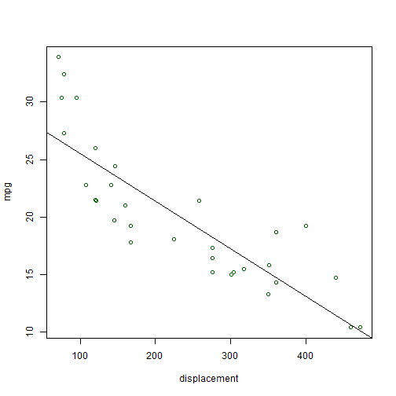
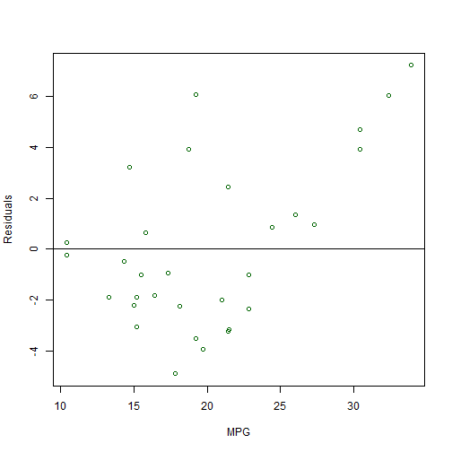

Developing Data Products, Assignment Week 4
========================================================
author: J. Schumacher 
date: March 13, 2017
autosize: true


Introduction
========================================================


- A shiny app was developed to conduct regression analyses using some of the variables in the "mtcars" data set

- The shiny app can be accessed using the following link: https://jensschum.shinyapps.io/ddp_week4/

- The source code is provided on Github: https://github.com/jensschum/ddp_week4
  
- A select box on the left side in the user interface can be used to select the variable for which the linear regression should be conducted.

- The outputs include the source data, fitted curve, R-squared value, regression equation and the residual plot for the selected variable.


Data Used for the Regression Analyses
========================================================


Motor Trend Car Road Tests

Description

The data was extracted from the 1974 Motor Trend US magazine, and comprises fuel consumption and 10 aspects of automobile design and performance for 32 automobiles (1973-74 models).

Source

Henderson and Velleman (1981), Building multiple regression models interactively. Biometrics, 37, 391-411.


Linear Regressions Variables
========================================================

mpg (Miles/(US) gallon) is the predicted value and the predictors are:


the number of cylinder (cyl)


displacement (disp)


gross horsepower (hp)


weight (wt)


qsec (1/4 mile time)


number of forward gears (gear)
 
Linear Regressions
========================================================

The following R code and plot show the linear regression using the displacement (disp) variable: 


```r
lm_f <- lm(mpg ~ disp, data = mtcars)
plot(mpg ~ disp, data = mtcars, ylab="mpg", xlab="displacement",col="darkgreen")
abline(lm_f)
```



Linear Regressions Residuals 
========================================================

The resdiual plots can be used to identify systematic bias in the regression:


```r
    resid = resid(lm_f)
    plot(resid ~ mtcars$mpg, ylab="Residuals", xlab="MPG",col="darkgreen")
    abline(0, 0)
```


